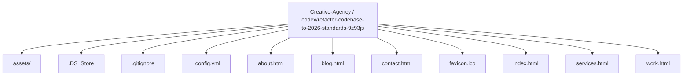
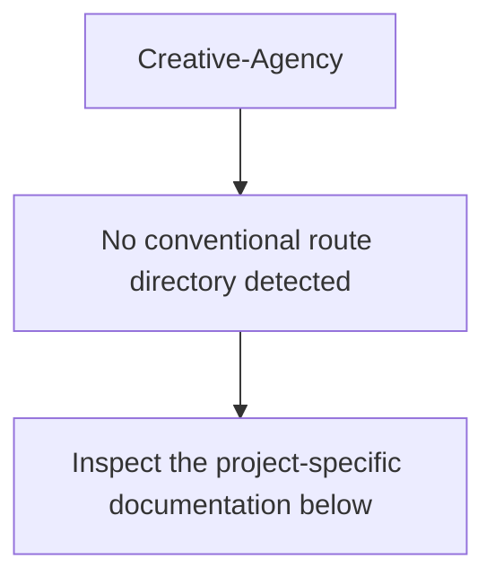
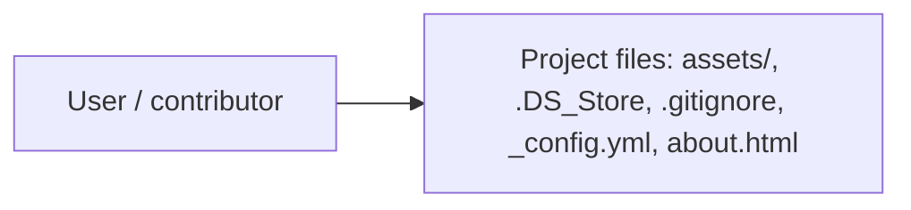
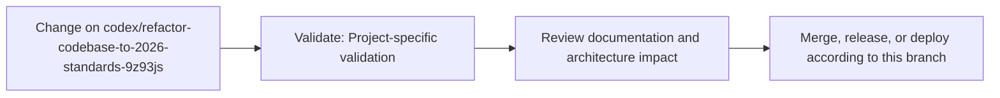

# Aurora Creative Co. — 2026 Atomic Front-End

<!-- interactive-readme-standard:start -->

> [!NOTE]
> **Branch-specific documentation:** this section is maintained for [`codex/refactor-codebase-to-2026-standards-9z93js`](https://github.com/Nischhalsubba/Creative-Agency/tree/codex/refactor-codebase-to-2026-standards-9z93js). It is generated from the files present on this branch and preserves the project-authored README below.

<details open>
<summary><strong>Interactive repository guide</strong></summary>

## Branch overview

| Item | Value |
|---|---|
| Repository | [`Nischhalsubba/Creative-Agency`](https://github.com/Nischhalsubba/Creative-Agency) |
| Branch | [`codex/refactor-codebase-to-2026-standards-9z93js`](https://github.com/Nischhalsubba/Creative-Agency/tree/codex/refactor-codebase-to-2026-standards-9z93js) |
| Detected stack | CSS, HTML, Sass, JavaScript |
| Detected manifests | No standard manifest detected |
| Documentation policy | Every maintained branch must explain purpose, setup, structure, architecture, flows, testing, delivery, security, and ownership. |

## Repository structure



The diagram is generated from the branch's actual top-level files and directories. Use the branch link above for complete source navigation.

## Website or application structure



## Application and responsibility flow



## Change-to-delivery flow



## README requirements for this branch

- Explain what this branch contains and how it differs from the default branch.
- Keep installation, configuration, usage, testing, deployment, security, support, and license information accurate.
- Document repository, website or application, API, data, authentication, background-job, and deployment flows when they exist.
- Prefer Mermaid diagrams and expandable `<details>` sections for visual navigation.
- Link diagrams and modules to real source paths; never invent missing components.
- Preserve project-specific documentation and update diagrams whenever architecture or major paths change.
- Treat secrets, private infrastructure, customer data, and credentials as prohibited README content.

</details>

<!-- interactive-readme-standard:end -->

Aurora Creative Co. is a Melbourne-based studio that partners with growth-focused teams to craft brand systems, digital
experiences, and launch campaigns. This repository contains the production-ready, SEO-forward website built for GitHub
Pages with a mobile-first, Atomic Design approach.

## Highlights

- **Atomic Design structure** for scalable front-end maintenance.
- **SEO-focused copy** across every page (home, about, services, work, insights, contact).
- **Accessible markup** with skip links, descriptive alt text, and clear structure.
- **Mobile-first structure** with responsive layout utilities in the existing stylesheet.
- **GitHub Pages ready** (static HTML/CSS/JS with local asset paths).
- **Open-source imagery** sourced from Unsplash and local MP4/WebM media included.

## Pages

| Page | Purpose |
| --- | --- |
| `index.html` | Primary landing page with featured work and services highlights. |
| `about.html` | Studio story, values, and positioning. |
| `services.html` | Full service overview and capabilities. |
| `work.html` | Project highlights and motion reel preview. |
| `blog.html` | Thought leadership and marketing insights. |
| `contact.html` | Contact details and project intake form. |

## Atomic Design Structure

```
assets/
  css/
    main.css           # compiled output used by GitHub Pages
    helper.css         # compiled helper utilities
    atomic/            # atomic CSS for runtime
  scss/
    atomic/
      _tokens.scss     # design tokens
      _base.scss       # global resets
      _utilities.scss  # helpers + utilities
      _components.scss # component styles extracted from main.css
      _sections.scss   # section-level styles (ready for growth)
```

### Why both CSS and SCSS?
- `assets/css/` files are the **runtime** styles used by GitHub Pages.
- `assets/scss/atomic/` files are the **source** styles for future modular development.

## Local Development

You can serve the project with any static server. For example:

```bash
python -m http.server 8000
```

Then open:

```
http://127.0.0.1:8000/index.html
```

## Deployment (GitHub Pages)

1. Push the repository to GitHub.
2. In **Settings → Pages**, select the `main` branch.
3. Choose the root `/` folder.
4. GitHub Pages will serve the site using the static HTML/CSS/JS assets.

## Content & Media Notes

- Image assets reference Unsplash CDN links for high-quality, license-friendly visuals.
- Motion examples use the local `assets/vids/` MP4/WebM files for faster loading and offline use.
- Copywriting has been rewritten with modern SEO phrasing and clear service messaging.

## About the Agency

Aurora Creative Co. is a strategic creative studio specializing in brand identity, digital product design, and
performance campaigns. Our work blends research, storytelling, and visual craft to help ambitious teams grow with
clarity.

## Technology Used

- **HTML5** for semantic, accessible structure.
- **CSS3** with Atomic Design patterns for scalable styling.
- **SCSS** partials for modular source styling.
- **JavaScript (ES5/ES6)** for interactivity via the existing template scripts.
- **GitHub Pages** for static hosting.

## Project Role

I designed and coded this website end-to-end, including information architecture, SEO content strategy, and front-end
implementation.

## Editing Content

All pages contain **inline comments** above key sections and blocks to guide future edits. If you are modifying content, update the corresponding page and keep the section comments intact for maintainability.

## Branching & PR Guidance

For conflict-free merges into `main`, create a new feature branch from the latest `main`, keep changes scoped to a single
topic, and avoid rebasing after the PR is opened. This keeps GitHub Pages deployments predictable and easy to roll back.

## License

This project is intended for internal or client use. Replace Unsplash imagery with your own brand assets for production launch.
