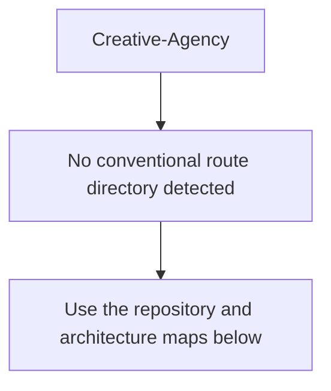
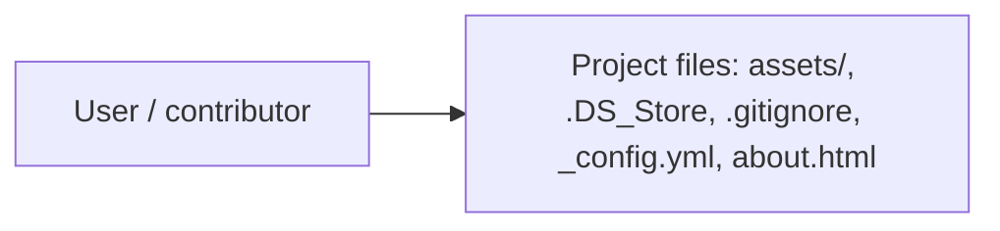
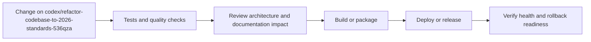
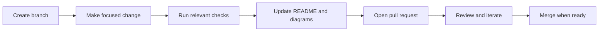

<!-- interactive-readme-standard:start -->

<div align="center">

# Creative-Agency

**Branch-aware technical guide for [`codex/refactor-codebase-to-2026-standards-536qza`](https://github.com/Nischhalsubba/Creative-Agency/tree/codex/refactor-codebase-to-2026-standards-536qza)**

<p>     </p>

<p>
  <a href="https://github.com/Nischhalsubba/Creative-Agency/tree/codex/refactor-codebase-to-2026-standards-536qza"><strong>Browse source</strong></a> ·
  <a href="https://github.com/Nischhalsubba/Creative-Agency/issues"><strong>Issues</strong></a> ·
  <a href="https://github.com/Nischhalsubba/Creative-Agency/codespaces/new?ref=codex%2Frefactor-codebase-to-2026-standards-536qza"><strong>Open in Codespaces</strong></a>
</p>

</div>

> [!IMPORTANT]
> This guide is generated from the files actually present on `codex/refactor-codebase-to-2026-standards-536qza`. It links to detected source paths, preserves project-authored notes, and avoids claiming components that were not found.

## At a glance

| Item | Detected value |
|---|---|
| Purpose | A CSS project documented from the current branch structure and manifests. |
| Branch role | Compared with `main` |
| Stack | CSS, HTML, Sass, JavaScript |
| Manifests | No standard manifest detected |
| Prerequisites | Confirm from the detected manifests |
| Delivery | No conventional deployment configuration detected |
| License | No license file detected |

## Branch scope

This branch differs from the default branch in the following detected paths:

- [`README.md`](https://github.com/Nischhalsubba/Creative-Agency/blob/codex/refactor-codebase-to-2026-standards-536qza/README.md)

## Quick start

> No reliable setup command was detected. Use the preserved project-authored notes and manifests rather than guessing.

### Configuration surface

- No committed environment example file was detected.

> Never commit secrets, private keys, production credentials, customer data, or unredacted infrastructure details.

## Repository map


| Responsibility | Detected source paths |
|---|---|
| Project files | [`assets/`](https://github.com/Nischhalsubba/Creative-Agency/tree/codex/refactor-codebase-to-2026-standards-536qza/assets/), [`.DS_Store`](https://github.com/Nischhalsubba/Creative-Agency/blob/codex/refactor-codebase-to-2026-standards-536qza/.DS_Store), [`.gitignore`](https://github.com/Nischhalsubba/Creative-Agency/blob/codex/refactor-codebase-to-2026-standards-536qza/.gitignore), [`_config.yml`](https://github.com/Nischhalsubba/Creative-Agency/blob/codex/refactor-codebase-to-2026-standards-536qza/_config.yml), [`about.html`](https://github.com/Nischhalsubba/Creative-Agency/blob/codex/refactor-codebase-to-2026-standards-536qza/about.html) |

## Website or application map



## Architecture and responsibility flow




## Quality, security, and operations

<table>
<tr>
<td width="33%" valign="top">

### Quality

- No conventional test directory was detected automatically.

Detected commands:
- No standard quality command detected.

</td>
<td width="33%" valign="top">

### Security

- No dedicated security policy or automated dependency configuration was detected.

Review authentication, authorization, input validation, dependency updates, secret handling, and failure recovery before release.

</td>
<td width="34%" valign="top">

### Observability

- No dedicated observability integration was detected automatically.

Define useful logs, metrics, traces, alerts, and rollback signals for production-facing branches.

</td>
</tr>
</table>

## Delivery flow



### Automation detected

- No GitHub Actions workflow files were detected.

## Contribution flow



- Keep changes focused and explain architectural consequences.
- Run the checks relevant to the changed area.
- Update diagrams whenever routes, modules, data models, authentication, jobs, or delivery paths change.
- Add screenshots or recordings for visual behavior changes when useful.
- Use issues for reproducible defects and pull requests for reviewable changes.

## Ownership and support

| Topic | Source |
|---|---|
| Repository | [`Nischhalsubba/Creative-Agency`](https://github.com/Nischhalsubba/Creative-Agency) |
| Branch | [`codex/refactor-codebase-to-2026-standards-536qza`](https://github.com/Nischhalsubba/Creative-Agency/tree/codex/refactor-codebase-to-2026-standards-536qza) |
| Ownership | No CODEOWNERS file detected |
| Contributing | Use the contribution flow above |
| Support | [Open or review issues](https://github.com/Nischhalsubba/Creative-Agency/issues) |
| License | No license file detected |

<details>
<summary><strong>Documentation maintenance checklist</strong></summary>

- [ ] Purpose and branch scope are accurate.
- [ ] Setup and configuration commands still work.
- [ ] Repository, application, API, data, authentication, job, and deployment diagrams match the code.
- [ ] Tests, security controls, observability, and rollback behavior are documented.
- [ ] Links point to real files on this branch.
- [ ] No secrets or private operational details are exposed.

</details>

<!-- interactive-readme-standard:end -->

<!-- project-authored-notes:start -->
<details>
<summary><strong>Project-authored notes preserved from this branch</strong></summary>

# Creative Agency — 2026 Atomic Front-End

A modernized, SEO-forward creative agency site built for GitHub Pages. The codebase is organized using **Atomic Design** principles, with clear HTML comments and modular SCSS structure to make future changes predictable and fast.

## Highlights

- **Atomic Design structure** for scalable front-end maintenance.
- **SEO-focused copy** across every page (home, about, services, work, insights, contact).
- **Accessible markup** with skip links, descriptive alt text, and clear structure.
- **GitHub Pages ready** (static HTML/CSS/JS with local asset paths).
- **Open-source imagery** sourced from Unsplash and local MP4/WebM media included.

## Pages

| Page | Purpose |
| --- | --- |
| `index.html` | Primary landing page with featured work and services highlights. |
| `about.html` | Studio story, values, and positioning. |
| `services.html` | Full service overview and capabilities. |
| `work.html` | Project highlights and motion reel preview. |
| `blog.html` | Thought leadership and marketing insights. |
| `contact.html` | Contact details and project intake form. |

## Atomic Design Structure

```
assets/
  css/
    main.css           # compiled output used by GitHub Pages
    helper.css         # compiled helper utilities
    atomic/            # atomic CSS for runtime
  scss/
    atomic/
      _tokens.scss     # design tokens
      _base.scss       # global resets
      _utilities.scss  # helpers + utilities
      _components.scss # component styles extracted from main.css
      _sections.scss   # section-level styles (ready for growth)
```

### Why both CSS and SCSS?
- `assets/css/` files are the **runtime** styles used by GitHub Pages.
- `assets/scss/atomic/` files are the **source** styles for future modular development.

## Local Development

You can serve the project with any static server. For example:

```bash
python -m http.server 8000
```

Then open:

```
http://127.0.0.1:8000/index.html
```

## Deployment (GitHub Pages)

1. Push the repository to GitHub.
2. In **Settings → Pages**, select the `main` branch.
3. Choose the root `/` folder.
4. GitHub Pages will serve the site using the static HTML/CSS/JS assets.

## Content & Media Notes

- Image assets reference Unsplash CDN links for high-quality, license-friendly visuals.
- Motion examples use the local `assets/vids/` MP4/WebM files for faster loading and offline use.
- Copywriting has been rewritten with modern SEO phrasing and clear service messaging.

## Editing Content

All pages contain **inline comments** above key sections and blocks to guide future edits. If you are modifying content, update the corresponding page and keep the section comments intact for maintainability.

## License

This project is intended for internal or client use. Replace Unsplash imagery with your own brand assets for production launch.

</details>
<!-- project-authored-notes:end -->
