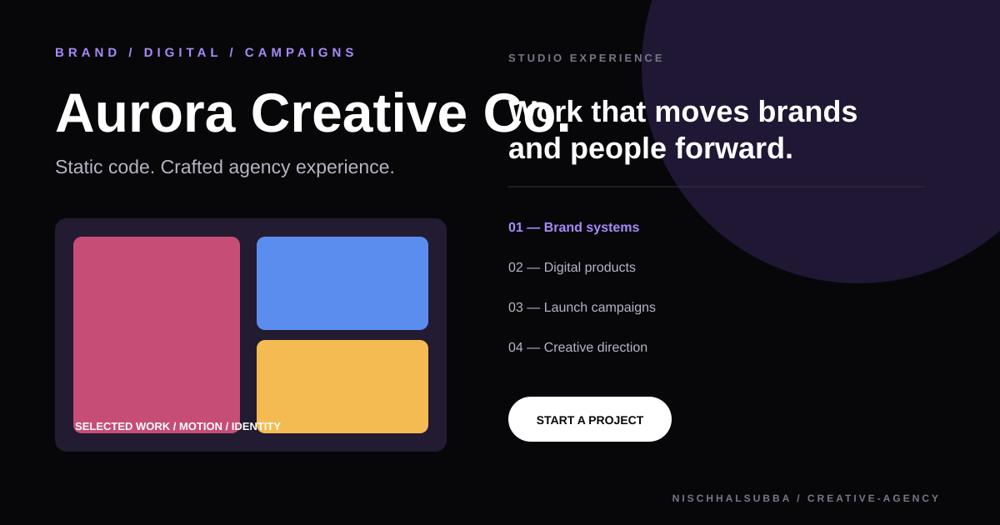

# Creative Agency Repository Overview

## Classification

Aurora Creative Co. is a multi-page static agency website using HTML, CSS, JavaScript, SCSS source organization, and vendor interaction libraries.

- Pages: home, about, services, work, insights, and contact
- Presentation: cinematic dark agency theme
- Deployment: GitHub Pages-compatible, not reverified during this pass
- Fresh screenshot: unavailable because public hosts could not be resolved
- Visual above: local designed thumbnail, not runtime evidence

## Highest-priority checks

1. Verify every page, menu transition, accordion, gallery, video, and contact path.
2. Add reduced-motion handling for cursor and transition effects.
3. Replace all template assets and business claims before production use.
4. Validate unique metadata, sitemap, robots policy, and forms.
5. Review vendor licenses and remove unused libraries.